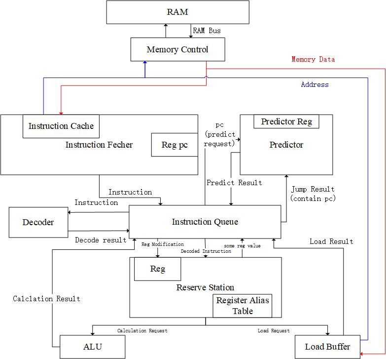
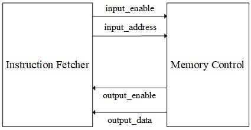

# RISCV-CPU 2022
## Design

The general idea is to base the whole CPU
on [the stimulator written in c++](https://github.com/KelvinMYYZJ/RISCV) ([see the **ugle** original design here](README.assets/ppca_cpu_structure.jpg)) and use extra parts to make it more **REAL**.

## Great ideas
### Implication of multi-clock request (like memory load and store)

Let's take instruction fetcher and memory controler as example: 

When there is no request, both the `enable` should be set to `0`

When the 'caller' (instruction fetcher here) have a request and find `input_enable` is `0` (which means there's no pending request), it should: 
- set `input_enable` to `1` 
- fill in the `input_data`
- keep waiting (don't send a new request)

When the 'callee' (Memory Control here) find `input_enable` is `1`, it start working.

When callee finish working, it should
- set `output_enable` to `1` **only for a cycle** (and then set it to `0`)

When the caller find `output_enable` is `1` (the request is dealt), it should:
- save the result (`output_data` here) (because it may change after that).
- set `input_enable` to `0` (which means now it can send a new request)